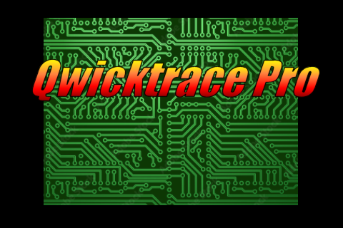

# Qwicktrace Pro PCB
Qwicktrace PCB is the software component of the QwickFab PCB open source desktop circuit board fabrication system.
The system dramatically reduces the time and skill required to make top quality single and double sided circuit 
boards for prototyping and one off use. Using QwickFab PCB, making a PCB is as simple as uploading your Gerber files to 
the Pro controller, selecting the process you wish to use to create the board, and then following the on-screen step
by step instructions. 

# Overview
The QwickFab desktop fabrication system consists of three major hardware components and one optional one:

1. The Qwicktrace Pro Controller is small control device with touchscreen and joystick powered by a Raspberry Pi 4 and the software
found in this repository. It is comprised of a software stack and UI for controlling the other two hardware components below. The 
Controller can run either of the two other components individually, or together as a complete desktop PCB fabrication system.

2. The Qwicktrace Exposure Table is a small device for quickly exposing photosensitive copper boards to ultraviolet light masked using a process called "Masked Stereolithography" (MSLA). The all new design of this exposure system adds an amber LED "safe light" for illuminating the mask for end user board positioning that is invisible to the photosenstive board.

3. The Qwickmill mini CNC is a small desktop CNC machine designed specifically for working with small printed circuit boards. It can
quickly drill the holes needed by through hole components on boards processed with the Exposure table.  It can also mill an entire PCB on blank copper boards using special ingraving bits. This is handy if your board is simple enough as to not need the better resolution of the exposure table, or if you are on a budget and would prefer not to spend the extra money on photosensitive boards. 
Finally, the Qwickmill can be used to cut board stock down to smaller sizes.

4. The QwickEtch Etching tank is a small container that can be used to quickly etch boards exposed with the Exposure table using
a minimal mount of equipment. While any type of container can be used, the QwickEtch tank has an air pump powered agitator in
in, removing the need for you to manually rock the etching tank.

The software on the Pro Controller (source code found on this repo) handles the more challenging aspects of making a PCB, such as aligning the drilling with the traces made on the exposure table, or positioning the opposite side of a board on a double sided PCB.

While the above hardware components make for a convenient set of tools, many Makers already have existing equipment they'd like
to use in place of a QwickFab component. You are free to mix and match any or all of the components that you wish.  You could
in theory build NONE of the hardware components and simply run the Qwicktrace software on an old laptop or pre-existing 
Raspberry Pi build.  The Qwickmill is built upon the open source standard Grbl controller. If you already own a CNC machines that uses Grbl, you can use that instead. It is easy to create a cable that connects from the Pro Controller to any CNC machine, such a 3018 or 1610. If you are on a budget, you can sometimes source a kit for one of these machines for less money than the individual parts for building the Qwickmill.

# Software features

* Creates PCB trace masks directly from Gerber files in SVG for MSLA exposure and/or in g-code for isolation milling
* Software deskewing of traces and drill holes makes combining MSLA, milling, and/or double sided boards quick and easy.
* Software autoleveling ensures isolation milling traces are cut to perfect depth
* Drill/mill features works with any Grbl compatible CNC controller
* UI designed for small 3.5" touchscreen
* Supports joystick input via ADS115 for easy jogging of CNC machine and alignment of drill holes
* Turns Raspberry Pi into a remote access server and controller for Grbl CNC machines

# DIY construction of a QwickFab system

The Qwickfab Pro system is made from parts printed with your 3D printer as well as easy to obtain off the shelf parts. The
STL files for this project can be found here in this repo in the `stl-files` directory. A complete bill of materials can be
found in the `docs` directory, along with build instructions and other technical documentation.

To install the software on the Raspberry Pi, see the file `Setting up Raspberry Pi`, also in `docs`

# Development

The Qwicktrace user interface on the Pro Controller is a touchscreen app written in NodeJS/Javascript and built with the
Electron framework.  This UI is layered on top of a software stack comprised of many great open source software packages. These include:

1. [Tracespace](https://github.com/tracespace) Gerber processing library for Javascript
2. [pcb2gcode](https://github.com/pcb2gcode/pcb2gcode) Gerber to GCode utility for milling isolation traces
3. [CNCjs](https://github.com/cncjs/cncjs) Web interface and Grbl server for CNC machine control
4. [EventEmitter2](https://github.com/EventEmitter2/EventEmitter2) Advanced event handling for NodeJS

For additional technical information on the Qwicktrace software architecture, see the `docs` directory
